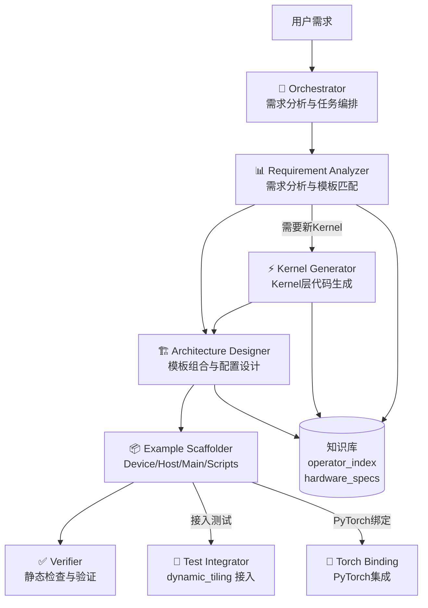
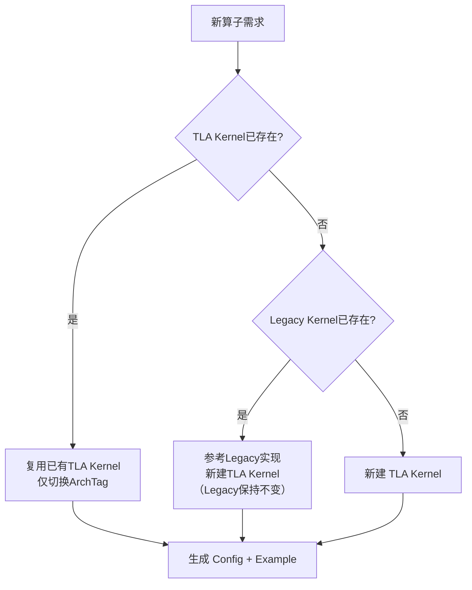

# CATCCOS Agent System

CATCCOS（CANN Templates for Compute-Communication Overlap Subroutines）算子开发 Agent 系统。基于结构化 SKILL 知识库，自动化通算融合算子的需求分析、架构设计、代码生成和测试接入。

## 仓库架构

```
catccos/
├── include/catccos/
│   ├── dgemm/
│   │   ├── kernel/     # 25个Kernel模板（算子核心逻辑）
│   │   ├── device/     # DeviceDGemm 封装（Host端启动入口）
│   │   └── block/      # Block层计算调度/数据搬运
│   ├── comm/
│   │   ├── block/      # Block层通信模块（remote_copy, scheduler等）
│   │   └── tile/       # Tile层远程搬运
│   ├── epilogue/       # Epilogue块（后处理）
│   └── arch/           # 跨Rank同步
├── .agent/
│   └── skills/         # Agent SKILL 知识库（本目录）
├── examples/           # 34个算子样例（每个含device.h, host.h, main.cpp, scripts/）
├── tests/              # 批量测试框架（dynamic_tiling）
└── docs/               # 文档
```

---

## Agent 架构



### SKILL 目录结构

```
.agent/skills/
├── README.md                          # 本文件
├── init.sh                            # 多工具初始化脚本
├── knowledge-base/
│   ├── operator_index.md              # 25个Kernel模板 + 34个Example 结构化索引
│   └── hardware_specs.md              # 硬件参数（存储/带宽/数据类型支持）
├── orchestrator/SKILL.md              # 编排器：调度全链路 + 依赖管理
├── requirement-analyzer/SKILL.md      # 需求解析 → 模板匹配 → 结构化报告
├── architecture-designer/SKILL.md     # Config struct 设计（TLA-first 决策树）
├── kernel-generator/SKILL.md          # 新 Kernel 模板生成（Legacy→TLA / 全新）
├── example-scaffolder/SKILL.md        # 完整 Example 目录生成（含脚本 + gen_data）
├── verifier/SKILL.md                  # 静态检查（7类21项）
├── test-integrator/SKILL.md           # dynamic_tiling 7步接入
└── torch-binding/SKILL.md             # PyTorch 绑定生成
```

### SubAgent 职责与执行顺序

| 顺序 | SubAgent | SKILL | 输入 | 输出 |
|------|----------|-------|------|------|
| 1 | Requirement Analyzer | `requirement-analyzer/` | 用户自然语言 | 需求分析报告 (YAML) |
| 2 | Architecture Designer | `architecture-designer/` | 需求分析报告 | `_device.h` |
| 3 | Kernel Generator | `kernel-generator/` | 需求分析报告 | `kernel.hpp`（仅需新 Kernel 时） |
| 4 | Example Scaffolder | `example-scaffolder/` | `_device.h` | 完整 Example 目录（8个文件） |
| 5 | Verifier | `verifier/` | 所有生成文件 | 验证报告 |
| 6 | Test Integrator | `test-integrator/` | Example | dynamic_tiling 接入代码 |
| 7 | Torch Binding | `torch-binding/` | Example | PyTorch wrapper |

---

## 核心设计原则

### TLA-first 策略

> **优先使用 TLA API**，实现单一 Kernel 模板跨架构复用。

- **新算子**：直接使用 TLA API（`tla::Shape`, `BlockMmadTla`, `MmadPingpong<ArchTag>`）
- **已有 Legacy Kernel**：不修改原 Kernel，参考其逻辑新建 TLA 版本并行共存
- **已有 TLA Kernel**：直接复用，仅新建 Config 切换 ArchTag

**实证**：`grouped_matmul_alltoallv_tla` (AtlasA2) 和 `ascend950_grouped_matmul_alltoallv` (Ascend950) 共享同一个 Kernel 模板 `GroupedMatmulAllToAllVTla`，仅 Config 中的 `ArchTag` 和 `MmadDispatchPolicy` 不同。

#### TLA vs Legacy API 对照

| 维度 | TLA API（推荐） | Legacy API（存量兼容） |
|------|-------------|------------------|
| TileShape | `tla::Shape<tla::Int<M>, tla::Int<N>, tla::Int<K>>` | `Catlass::GemmShape<M, N, K>` |
| BlockMmad | `BlockMmadTla<Policy, L1, L0, EA, EB, EC, void, TileCopy>` | `BlockMmad<Policy, L1, L0, AType, BType, CType>` |
| DispatchPolicy | `MmadPingpong<ArchTag, enableUnitFlag, ...>` | `MmadAtlasA2Pingpong<enableUnitFlag>` |
| TileCopy | `PackedTileCopyTla<ArchTag, EA, LA, EB, LB, EC, LC>` | 不需要 |

> **Legacy Kernel 不进行迁移或删除**。已有用户可能直接使用了模板库的 Legacy Kernel 实现，必须保持向后兼容。新建的 TLA Kernel 与 Legacy Kernel 并行共存。

### 跨架构 Config 差异

AtlasA2 和 Ascend950 共享同一 TLA Kernel，仅 Config 不同：

```cpp
// === AtlasA2 Config（简洁） ===
using ArchTag = Catlass::Arch::AtlasA2;
using MmadDispatchPolicy = Catlass::Gemm::MmadPingpong<ArchTag, true>;

// === Ascend950 Config（需显式 buffer stage 参数） ===
using ArchTag = Catlass::Arch::Ascend950;
using MmadDispatchPolicy = Catlass::Gemm::MmadPingpong<
    ArchTag, true, false, 1, false, 2, 2, 2, 2>;
```

### 决策流程



---

## 算子开发标准流程

基于 CATCCOS 开发一个新的通算融合算子：

1. **Kernel层**：选择已有 Kernel 或在 `include/catccos/dgemm/kernel/` 下新建
2. **Device层配置**：在 `examples/<op>/<op>_device.h` 中用 Config struct 组装模板参数
3. **Host层逻辑**：在 `examples/<op>/<op>_host.h` 中实现内存分配/结果回收
4. **Main入口**：在 `examples/<op>/main.cpp` 中构造 Arguments → Initialize → Run
5. **构建脚本**：`scripts/build.sh`, `scripts/run.sh`, `test_shapes.csv`
6. **（可选）测试接入**：修改 `info.h` + `operator_host.h` + Launch 函数 + `launch_map.h`
7. **（可选）PyTorch绑定**：wrapper + torch_bindings + Meta kernel

### Example 目录结构标准

```
examples/<op_name>/
├── CMakeLists.txt                # catccos_example_add_executable 宏
├── README.md                     # 使用说明
├── <op_name>_device.h            # Config struct + 预定义 tiling 配置
├── <op_name>_host.h              # 继承 CatccosOperator
├── main.cpp                      # 入口
└── scripts/
    ├── build.sh                  # 编译脚本
    ├── run.sh                    # 运行脚本（gen_data → 多rank启动 → verify）
    ├── test_shapes.csv           # 测试形状（M,K,N）
    └── gen_data.py               # 数据生成（仅全新算子需要）
```

---

## 通信模式速查

| 通信模式 | 默认 CopyDirect | 计算/通信顺序 | 典型 Scheduler | 需要 AtomicAdd |
|----------|----------------|---------------|----------------|----------------|
| AllGather | Put | 通信先 → 计算 | `BlockCommSwizzle` | No |
| ReduceScatter | Get | 计算先 → 通信 | `BlockCommSchedulerReduceScatter` | Yes |
| AllReduce | Get | 计算先 → 通信 | `BlockCommSwizzle` | Yes |
| AllToAllV (MoE) | Get | 计算先 → 通信 | `BlockCommSchedulerReduceScatterAllToAllV` | No |
| AllToAll | Put | 视方向而定 | `BlockCommSwizzle` | No |

> **CopyDirect 默认规则（由计算/通信顺序决定）**：
> - **通信先 → Put**：本地数据 put 到 shmem → shmem 通信结果直接用于计算 → 结果放在 local GM
> - **计算先 → Get**：本地计算后结果放到 shmem → 从远端 shmem get 数据到本地 local GM
>
> CopyDirect 与通信模式完全解耦，用户可显式覆盖。如 AllGather 可用 Get（`allgather_matmul_remote_read`）、ReduceScatter 可用 Put（`matmul_dequant_reduce_scatter_v2`）。

## 架构参数速查

| 参数 | AtlasA2 | Ascend950 |
|------|---------|-----------| 
| ArchTag | `Catlass::Arch::AtlasA2` | `Catlass::Arch::Ascend950` |
| CATLASS_ARCH | `2201` | `3510` |
| 模板库支持 | Legacy + TLA | TLA only |
| L0C 大小 | 128K | 256K |
| 核数 | 24AIC + 48AIV | 32AIC + 64AIV |
| FP8 支持 | ❌ | ✅ |
| MXFP8/MXFP4 | ❌ | ✅ |

详细参数见 [hardware_specs.md](knowledge-base/hardware_specs.md)。

---

## 使用示例

### 场景 1: 标准算子（复用已有 Kernel）

```
用户: "我需要一个 Ascend950 的 MatmulReduceScatter 算子，FP16"
```

执行链：`Requirement Analyzer → Architecture Designer → Example Scaffolder → Verifier`

### 场景 2: Legacy → TLA 升级

```
用户: "把 matmul_allreduce 改成 TLA 版本"
```

执行链：`Requirement Analyzer → Kernel Generator → Architecture Designer → Example Scaffolder → Verifier`

### 场景 3: 全链路

```
用户: "全新的 MoE 融合算子，支持全架构，接入测试，提供 PyTorch 绑定"
```

执行链：`Requirement Analyzer → Kernel Generator → Architecture Designer → Example Scaffolder → Verifier → Test Integrator → Torch Binding`

---

## 安装与配置

通过 `init.sh` 脚本将 CATCCOS Agent 技能安装到不同的 AI 编程工具中。

### 快速开始

```bash
# 在仓库根目录下运行
bash .agent/skills/init.sh
```

默认以 **project 级别** 安装到 **Gemini CLI**。

### 支持的工具

| 工具 | 配置目录 | 配置文件 | 安装命令 |
|------|---------|---------|---------|
| Gemini CLI | `.gemini/skills/` | `GEMINI.md` | `bash .agent/skills/init.sh project gemini` |
| Claude Code | `.claude/skills/` | `CLAUDE.md` | `bash .agent/skills/init.sh project claude` |
| Cursor | `.cursor/skills/` | `.cursorrules` | `bash .agent/skills/init.sh project cursor` |
| Trae | `.trae/skills/` | `AGENTS.md` | `bash .agent/skills/init.sh project trae` |
| GitHub Copilot | `.github/skills/` | `AGENTS.md` | `bash .agent/skills/init.sh project copilot` |

### 安装级别

```bash
# Project 级别（默认）：安装到当前项目
bash .agent/skills/init.sh project gemini

# Global 级别：安装到用户主目录
bash .agent/skills/init.sh global claude

# 指定安装路径
bash .agent/skills/init.sh project gemini /path/to/target/project
```

### 安装原理

`init.sh` 执行 3 个步骤：

1. **链接技能** — 为每个 SKILL 创建 symlink 到工具的配置目录
2. **生成配置** — 创建工具专属的系统提示文件（含技能列表和工作流说明）
3. **健康检查** — 验证 symlink 完整性，生成 `catccos-manifest.json`

```
安装后目录结构示例（Gemini CLI）：

<project>/
├── .gemini/
│   ├── skills/
│   │   ├── orchestrator/      → .agent/skills/orchestrator/
│   │   ├── requirement-analyzer/ → .agent/skills/requirement-analyzer/
│   │   ├── ...                → (symlinks to .agent/skills/*)
│   │   └── knowledge-base/    → .agent/skills/knowledge-base/
│   └── catccos-manifest.json
├── GEMINI.md                  # 系统提示（自动生成）
└── .agent/
    └── skills/                # 技能源文件（本目录）
```

> 技能通过 symlink 安装，修改 `.agent/skills/` 下的源文件会立即生效，无需重新安装。

### 卸载

删除工具配置目录下的 symlink 和配置文件即可：

```bash
# 示例：卸载 Gemini CLI 配置
rm -rf .gemini/skills/orchestrator .gemini/skills/requirement-analyzer ...
rm GEMINI.md .gemini/catccos-manifest.json
```
