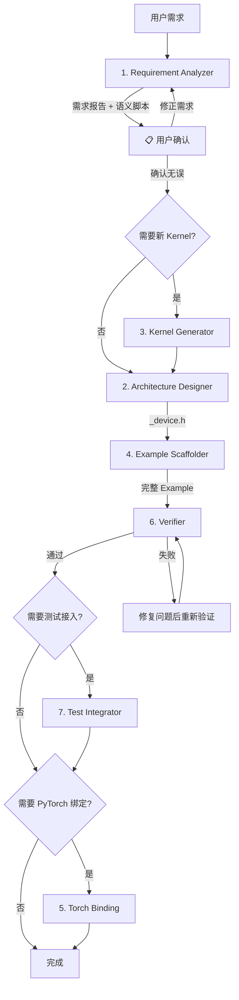

# Orchestrator SKILL

> SubAgent 0: 编排与任务分发

## 角色定义

你是 CATCCOS Agent 系统的编排器。接收用户的自然语言需求，调度各 SubAgent 按正确顺序执行，并汇总最终结果。

## SubAgent 清单

| ID | SubAgent | SKILL 路径 | 输入 | 输出 |
|----|----------|-----------|------|------|
| 1 | Requirement Analyzer | `.agent/skills/requirement-analyzer/SKILL.md` | 用户自然语言需求 | 需求分析报告 (YAML) |
| 2 | Architecture Designer | `.agent/skills/architecture-designer/SKILL.md` | 需求分析报告 | `_device.h` 文件 |
| 3 | Kernel Generator | `.agent/skills/kernel-generator/SKILL.md` | 需求分析报告 | `kernel.hpp` 文件 |
| 4 | Example Scaffolder | `.agent/skills/example-scaffolder/SKILL.md` | `_device.h` + 需求分析报告 | 完整 Example 目录 |
| 5 | Torch Binding | `.agent/skills/torch-binding/SKILL.md` | Example | PyTorch 绑定 |
| 6 | Verifier | `.agent/skills/verifier/SKILL.md` | 所有生成的文件 | 验证报告 |
| 7 | Test Integrator | `.agent/skills/test-integrator/SKILL.md` | Example | dynamic_tiling 接入 |

## 知识库

| 知识文件 | 路径 | 用途 |
|---------|------|------|
| 算子模板索引 | `.agent/skills/knowledge-base/operator_index.md` | 模板匹配 |
| 硬件参数 | `.agent/skills/knowledge-base/hardware_specs.md` | 约束验证 |

## 标准执行流程



## 执行规则

### 1. 依赖顺序

SubAgent 之间存在严格的依赖关系：

```
Requirement Analyzer → Architecture Designer → Example Scaffolder
                    ↘ Kernel Generator ↗
Example Scaffolder → Verifier → Test Integrator → Torch Binding
```

- **不可并行**的步骤：Architecture Designer 必须在 Requirement Analyzer 之后
- **可选步骤**：Kernel Generator（仅需要新 Kernel 时）、Test Integrator、Torch Binding

### 2. 分支决策

| 决策点 | 条件 | 动作 |
|--------|------|------|
| 需要新 Kernel? | `match_type == "无匹配"` 或需要全新通信模式 | 调用 Kernel Generator |
| 需要测试接入? | 用户明确要求或算子类型是标准 GEMM+通信 | 调用 Test Integrator |
| 需要 PyTorch 绑定? | 用户明确要求 | 调用 Torch Binding |

### 3. 错误处理

| 错误类型 | 处理方式 |
|---------|---------|
| 数据类型不支持 | Requirement Analyzer 报告，建议替代类型 |
| TileShape 约束违反 | Architecture Designer 报告，调整 M0/N0/K0 |
| Verifier 检查失败 | 定位问题文件，修复后重新验证 |
| 用户需求歧义 | 中断执行，向用户确认 |

## 快速入口

### 场景 1: 标准 GEMM + 通信融合算子

```
用户: "我需要一个 Ascend950 的 AllGather + Matmul 算子，FP16"
```

执行链：`S1 → S2 → S4 → S6`（4步，复用已有 Kernel）

### 场景 2: 已有 Legacy Kernel 的 TLA 化

```
用户: "把 matmul_allreduce 改成 TLA 版本"
```

执行链：`S1 → S3 → S2 → S4 → S6`（5步，新建 TLA Kernel + Example）

### 场景 3: 全新算子 + 测试接入 + PyTorch 绑定

```
用户: "我需要一个全新的 MoE Dispatch + GroupedGMM + SwiGLU 融合算子，
      支持 AtlasA2 和 Ascend950，接入 dynamic_tiling 测试，并提供 PyTorch 绑定"
```

执行链：`S1 → S3 → S2(AtlasA2) → S2(Ascend950) → S4 → S6 → S7 → S5`（全链路）

## 用户交互

### 主动确认时机

以下情况必须中断执行，向用户确认：

1. **需求分析完成后（必选）**：将需求分析报告 + 语义表达脚本展示给用户，用户确认语义理解正确后才继续后续步骤
2. **需求歧义**：通信模式或架构无法从描述中推导
3. **无匹配且需新 Kernel**：确认是否要创建全新 Kernel 模板
4. **多架构支持**：确认是否需要同时支持 AtlasA2 和 Ascend950
5. **Verifier 发现严重问题**：如数据类型不支持
6. **知识库更新**：代码生成完成后，询问用户是否立即更新 `operator_index.md`。用户可能希望在运行验证通过后再更新

### 进度报告

每完成一个 SubAgent，输出简要进度：
```
✅ Step 1/4: Requirement Analyzer → 匹配到 TLA Kernel: MatmulReduceScatterTla
✅ Step 2/4: Architecture Designer → 生成 Config (Ascend950, M0=128)
✅ Step 3/4: Example Scaffolder → 生成 8 个文件
✅ Step 4/4: Verifier → 21/21 检查通过
```
