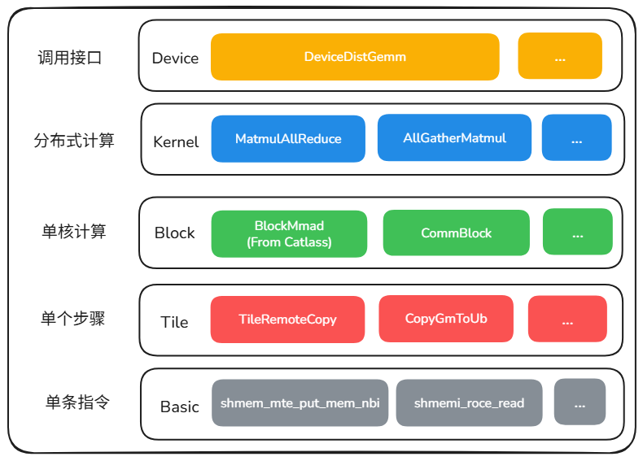

# CATCCOS

## 📌 简介

CATCCOS(**CA**NN **T**emplates for **C**ompute-**C**ommunication **O**verlap **S**ubroutines)，中文名为昇腾计算-通信融合算子模板库，是一个聚焦于提供高性能计算通信融合类算子基础模板的代码库。  

通过抽象分层的方式将计算-通信算子代码模板化。简化通算融合算子开发，解决易用性问题。内存语义实现计算通信细粒度并行，最大化掩盖度；根据计算通信特征，结合硬件架构深度优化，提供极致性能。

本代码仓为CATCCOS代码仓。结合昇腾生态力量，共同设计研发算子模板，并提供典型通算融合算子的高性能实现代码样例。

## 🧩 模板分层设计



分层详细介绍和各层级 API，见 [文档索引](docs/README.md)；API 分层说明见 [api/api.md](docs/api/api.md)；当前支持算子见 [operators.md](docs/operators.md)。

## 📁 目录结构说明

```bash
catccos
├── 3rdparty    # 依赖的catlass工程文件
├── docs        # 文档（索引见 docs/README.md，算子见 docs/operators.md）
├── examples    # kernel使用样例
└── include     # 模板头文件
```

## 💻 软硬件配套说明

- 硬件平台:
  - **CPU**: `aarch64`/`x86_64`
  - **NPU**: `Atlas A2 训练系列产品`/`Atlas 800I A2 推理产品`/`A200I A2 Box 异构组件`/`Atlas 350 加速卡`
    - `Atlas 800T A2 训练服务器`
    - `Atlas 900 A2 PoD 集群基础单元`
    - `Atlas 200T A2 Box16 异构子框`
    - `Atlas 800I A2 推理服务器`
    - `A200I A2 Box 异构组件`
    - `Atlas 350 加速卡`（`Ascend950PR`/`Ascend950DT`）

- 软件版本:
  - `gcc >= 7.5, < 13`（已测试`7.5`，`8.3`，`9.3`，`11.4`，建议使用9.3以上版本。）
  - `cmake >= 3.15`
  - `python >= 3.10`

- CANN版本:

| CANN包类别 | 版本要求                    | 获取方式                                                                                                             |
| ---------- | --------------------------- | -------------------------------------------------------------------------------------------------------------------- |
| 社区版     | 8.5.0.alpha002 及之后版本 | [社区CANN包下载地址](https://www.hiascend.com/developer/download/community/result?cann=8.5.0.alpha002) |
| 商用版     | 8.5.0及之后版本           | 请咨询对应Support/SupportE获取                                                                                       |

- 安装CANN开发套件包:
```bash
chmod +x Ascend-cann-toolkit_<version>_linux-<arch>.run
./Ascend-cann-toolkit_<version>_linux-<arch>.run --install
```

## 🚀 快速上手

以`matmul_allreduce`算子样例为例，快速上手CATCCOS算子开发：

1. 配置环境变量(可选)

  ```bash
  # 用于统一配置 CANN、SHMEM、CATLASS 相关环境变量（A2 默认）
  source ./examples/utils/setup.sh

  # Ascend950 算子需指定 soc 类型（首次编译 SHMEM 时生效）
  source ./examples/utils/setup.sh -soc_type Ascend950
  ```

注意：
- 配置环境变量时，若 CANN 未安装到默认路径，需先配置 `ASCEND_HOME_PATH` 环境变量。
- 若使用 `examples` 下的编译脚本，可跳过此步骤（各算子 `build.sh` 会自动 source 并传入所需参数）。
- `setup.sh` 的编译选项仅在 **首次** 构建 SHMEM（`3rdparty/shmem/install` 不存在）时生效；切换设备型号需删除该目录后重新执行，例如：
  ```bash
  rm -rf 3rdparty/shmem/install
  source ./examples/utils/setup.sh -soc_type Ascend950
  ```

2. 编译算子样例
进入examples下对应的算子目录并执行编译脚本，即可编译examples中的kernel代码。

```bash
cd examples/matmul_allreduce
bash scripts/build.sh
```

3. 执行算子样例
在示例目录下执行运行脚本，执行算子样例程序。

```bash
bash scripts/run.sh <device_list>
```

出现如下执行结果，说明算子运行成功，精度比较通过。
```bash
error num: 0
PASS
```

## 🛠 代码检查说明
代码检查请参考[pre-commit-guide.md](./docs/pre-commit-guide.md)文档。