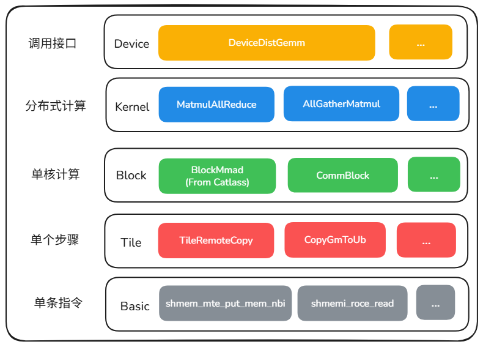

# CATCCOS

## 📌 简介

CATCCOS(**CA**NN **T**emplates for **C**ompute-**C**ommunication **O**verlap **S**ubroutines)，中文名为昇腾计算-通信融合算子模板库，是一个聚焦于提供高性能计算通信融合类算子基础模板的代码库。

通过抽象分层的方式将计算-通信算子代码模板化。简化通算融合算子开发，解决易用性问题。内存语义实现计算通信细粒度并行，最大化掩盖度；根据计算通信特征，结合硬件架构深度优化，提供极致性能。

本代码仓为CATCCOS代码仓。结合昇腾生态力量，共同设计研发算子模板，并提供典型通算融合算子的高性能实现代码样例。

## 🧩 模板分层设计



分层详细介绍和各层级 API，见 [文档索引](docs/README.md)；API 分层说明见 [api/api.md](docs/api/api.md)；当前支持算子见 [operators.md](docs/operators.md)。

## 📁 目录结构说明

```bash
catccos
├── 3rdparty    # 依赖的catlass工程文件
├── docs        # 文档（索引见 docs/README.md，算子见 docs/operators.md）
├── examples    # kernel使用样例
└── include     # 模板头文件
```

## 💻 软硬件配套说明

- 硬件平台:
  - **CPU**: `aarch64`/`x86_64`
  - **NPU**: `Atlas A2 训练系列产品`/`Atlas 800I A2 推理产品`/`A200I A2 Box 异构组件`/`Atlas 350 加速卡`
    - `Atlas 800T A2 训练服务器`
    - `Atlas 900 A2 PoD 集群基础单元`
    - `Atlas 200T A2 Box16 异构子框`
    - `Atlas 800I A2 推理服务器`
    - `A200I A2 Box 异构组件`
    - `Atlas 350 加速卡`（`Ascend950PR`/`Ascend950DT`）

- 软件版本:
  - `gcc >= 7.5, < 13`（已测试`7.5`，`8.3`，`9.3`，`11.4`，建议使用9.3以上版本。）
  - `cmake >= 3.10`
  - `python >= 3.10, < 3.14`（当前 `requirements.txt` 固定的 `torch==2.7.1+cpu` / `torch-npu==2.7.1.post8` 暂无 Python 3.14 wheel。）

- CANN版本:

| CANN包类别 | 版本要求                    | 获取方式                                                                                                             |
| ---------- | --------------------------- | -------------------------------------------------------------------------------------------------------------------- |
| 社区版     | 8.5.0.alpha002 及之后版本 | [社区CANN包下载地址](https://www.hiascend.com/developer/download/community/result?cann=8.5.0.alpha002) |
| 商用版     | 8.5.0及之后版本           | 请咨询对应Support/SupportE获取                                                                                       |

- 安装CANN开发套件包:
```bash
chmod +x Ascend-cann-toolkit_<version>_linux-<arch>.run
./Ascend-cann-toolkit_<version>_linux-<arch>.run --install
```

若通过 conda 渠道安装 CANN，工具链目录布局可能与 `.run` 安装不同：`bisheng` 可能位于
`$ASCEND_HOME_PATH/compiler/ccec_compiler/bin/bisheng`，而不是
`$ASCEND_HOME_PATH/tools/bisheng_compiler/bin/bisheng`。CATCCOS 的 CMake 会同时探测上述两种路径；若仍无法找到，可在 CMake 配置时显式传入 `-DCCEC=/path/to/bisheng`。

## 🚀 快速上手

以`matmul_allreduce`算子样例为例，快速上手CATCCOS算子开发：

1. 安装 Python 依赖

  在 CATCCOS 根目录下执行：

  ```bash
  python3 -m pip install -r requirements.txt
  ```

2. 配置环境变量(可选)

  ```bash
  # 用于统一配置 CANN、SHMEM、CATLASS 相关环境变量（A2 默认）
  source ./examples/utils/setup.sh

  # Ascend950 算子需指定 soc 类型（首次编译 SHMEM 时生效）
  source ./examples/utils/setup.sh -soc_type Ascend950
  ```

注意：
- 配置环境变量时，若 CANN 未安装到默认路径，需先配置 `ASCEND_HOME_PATH` 环境变量。
- 若 conda 安装 CANN 后将默认 `python3` 升级到 3.14，请新建并激活 Python 3.10 到 3.13 的环境后再执行 `python3 -m pip install -r requirements.txt`。
- `bisheng`（clang 15.x）在 aarch64 上可能自动选择系统中最高版本的 GCC 后端，而不一定跟随 `update-alternatives`。若系统存在 GCC 14，请同时安装匹配的标准库开发包，例如 `sudo apt install libstdc++-14-dev`，否则首次构建 SHMEM 时可能出现 `fatal error: cstdint file not found` 等标准 C++ 头文件缺失错误。
- 在部分 aarch64 系统 glibc 版本上，`bisheng` 可能触发 `/usr/include/aarch64-linux-gnu/bits/math-vector.h` 中 clang 相关的 NEON/SVE 向量声明兼容性问题。建议优先使用 CANN 配套或已验证的 OS / glibc 环境；若本地开发环境暂时无法调整，可通过在编译 include 路径前置一个本地 `bits/math-vector.h` 兼容 stub 作为临时规避，迁移到正式环境前应移除该 workaround。
- 若使用 `examples` 下的编译脚本，可跳过此步骤（各算子 `build.sh` 会自动 source 并传入所需参数）。
- `setup.sh` 的编译选项仅在 **首次** 构建 SHMEM（`3rdparty/shmem/install` 不存在）时生效；切换设备型号需删除该目录后重新执行，例如：
  ```bash
  rm -rf 3rdparty/shmem/install
  source ./examples/utils/setup.sh -soc_type Ascend950
  ```

3. 编译算子样例
进入examples下对应的算子目录并执行编译脚本，即可编译examples中的kernel代码。

```bash
cd examples/matmul_allreduce
bash scripts/build.sh
```

4. 执行算子样例
在示例目录下执行运行脚本，执行算子样例程序。

```bash
# bash scripts/run.sh <device_list>
# device_list为选择的设备编号，以启动两卡执行任务为例
bash scripts/run.sh 0,1
```

出现如下执行结果，说明算子运行成功，精度比较通过。
```bash
error num: 0
PASS
```

## 🛠 代码检查说明
代码检查请参考[pre-commit-guide.md](./docs/pre-commit-guide.md)文档。
