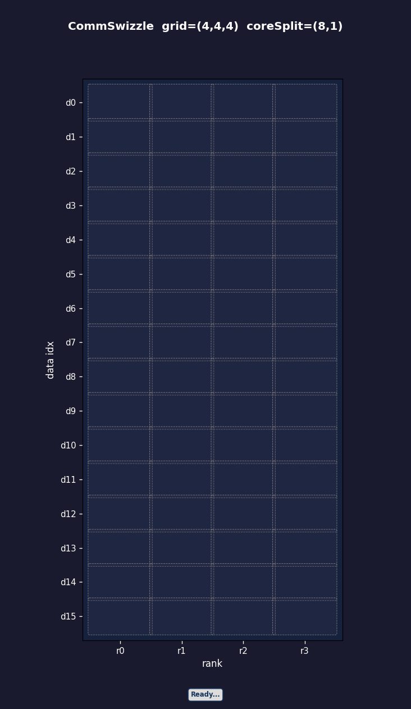
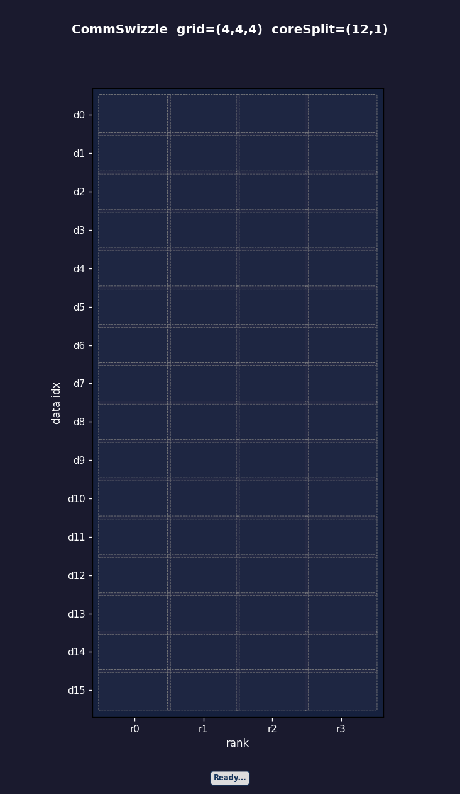
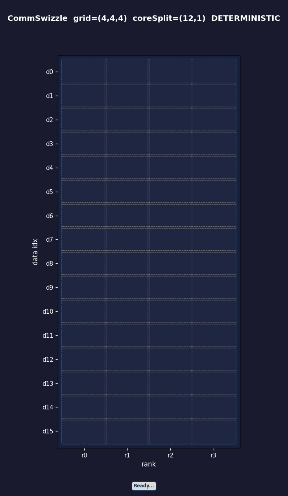

# CommSwizzle 通信调度算法详解

## 概述

[CommSwizzle](../../include/catccos/catccos.hpp#165-194) 是 catccos 库中用于**多核并行通信调度**的 swizzle 算法。它解决的核心问题是：当多个 core 需要同时与多个远程 rank 进行数据通信时，**如何调度通信顺序，使得在同一时刻不同 core 访问不同的 rank，从而避免通信链路拥塞**。

## 核心数据结构

| 参数 | 类型 | 含义 |
|------|------|------|
| `gridShape` | [DistMatrixCoord(row, column, rank)](../../include/catccos/dist_coord.hpp#42-47) | 通信数据的三维网格形状：row × column 为数据维度，rank 为远程节点数 |
| `coreSplit` | [MatrixCoord(row, column)](../../include/catccos/dist_coord.hpp#42-47) | 并行 core 在数据维度(row)和 rank 维度(column)的划分 |
| `loopIdx` | `uint32_t` | 迭代索引，范围 `[0, Numel(gridShape))` |

## 算法步骤

### 第一步：3D → 2D 展平

将三维 `gridShape(row, column, rank)` 展平为二维矩阵：

``` cpp
flattenGridShape = { row * column /* 数据维(行) */,  rank /* rank维(列) */}
```

### 第二步：分组列优先遍历
以 `swizzleOffset = coreSplit[ROW_DIM]`（数据维度的 core 并行度）为分组大小：

1. **分组**：将`ROW_DIM`维度按 `swizzleOffset` 分成若干组
2. **组内遍历**：在每个组内，先遍历`ROW_DIM`，再遍历`COL_DIM`，即`ROW_DIM`方向的的 swizzleOffset 个数据连续分配

```
groupSize = swizzleOffset × numRanks
组内 loopIdx → coord[COL] = groupOffset / inGroupRows   (ROW_DIM索引)
              coord[ROW] = groupIdx * swizzleOffset + groupOffset % inGroupRows
```

具体效果如图所示：



> [!NOTE]
> 配置
>
> - GRID_ROW = 4             # gridShape.row
> - GRID_COL = 4             # gridShape.column
> - GRID_RANK = 4            # gridShape.rank
> - CORE_SPLIT_ROW = 8       # coreSplit.row  (data-dim parallelism)
> - CORE_SPLIT_COL = 1       # coreSplit.column > (rank-dim parallelism)
> - SWIZZLE_DIRECTION = 0    # 0: row-major swizzle

### 第三步：Rank Shift（核心创新）

对列索引（rank 维度）施加一个**依赖于行索引的偏移**：

```cpp
uint32_t nStride = gridShape.rank() / coreSplit.column();
uint32_t offset = coord[1] * nStride;
coord[1] = (offset + offset / gridShape.rank() + coord[0]) % gridShape.rank();
```

效果：**不同行的 core 在同一 loopIdx 下访问不同的 rank**，实现通信错开:


> [!NOTE]
> 配置
>
> - GRID_ROW = 4             # gridShape.row
> - GRID_COL = 4             # gridShape.column
> - GRID_RANK = 4            # gridShape.rank
> - CORE_SPLIT_ROW = 8       # coreSplit.row  (data-dim parallelism)
> - CORE_SPLIT_COL = 1       # coreSplit.column > (rank-dim parallelism)
> - SWIZZLE_DIRECTION = 0    # 0: row-major swizzle

### 第四步：2D → 3D 还原

将展平的坐标还原为 [DistMatrixCoord](../../include/catccos/dist_coord.hpp#42-47)：

```cpp
return DistMatrixCoord{coord[0] / gridShape.column(),   // row
                       coord[0] % gridShape.column(),   // column
                       coord[1]};                       // rank
```

## 算法效果示意

假设 `gridShape = (2, 2, 4)`, `coreSplit = (2, 2)`：

| loopIdx | 展平坐标 (data, rank) | Shift后 rank | 最终 (row, col, rank) |
|---------|----------------------|-------------|----------------------|
| 0 | (0, 0) | 0 | (0, 0, 0) |
| 1 | (1, 0) | 1 | (0, 1, 1) |
| 2 | (0, 1) | 2 | (0, 0, 2) |
| 3 | (1, 1) | 3 | (0, 1, 3) |
| ... | ... | ... | ... |

> [!TIP]
> 这个效果类似于 **Latin Square** 调度——在任意时刻，每个 core 访问的 rank 都尽量不同，最大化通信带宽利用率。

## 设计目标

1. **避免通信冲突**：Rank Shift 确保同一时刻不同 core 错开访问不同的远程 rank
2. **提高带宽利用率**：分组遍历 + Rank Shift 错位访问使通信链路负载均匀
3. **支持确定性模式**：`IS_DETERMINISTIC` 模式只有一个core固定负责不同rank的同一位置（同一数据index）的数据，避免了多个core搬运同一位置（同一数据index）的数据，导致数据到达顺序不可控。当搬运不同rank的数据，并使用`atomic add`操作进行`reduce add`时，使用这个模式可以保证计算结果的可复现性。

   - 如下图所示，没有开启确定性计算，在step4，每次有三个core并行操作不同rank的同一数据维度的数据：

   

    - 开启确定性计算之后，step4~step7都只有一个core在操作一个rank的数据，步骤从6步增加到8步：
    
    

> [!NOTE]
> 配置
>
> - GRID_ROW = 4             # gridShape.row
> - GRID_COL = 4             # gridShape.column
> - GRID_RANK = 4            # gridShape.rank
> - CORE_SPLIT_ROW = 12      # coreSplit.row  (data-dim parallelism)
> - CORE_SPLIT_COL = 1       # coreSplit.column > (rank-dim parallelism)
> - SWIZZLE_DIRECTION = 0    # 0: row-major swizzle

## 模拟
通过运行 `python comm_swizzle_animation.py` 可以模拟 `comm_swizzle`，通过以下配置修改：

``` python
GRID_ROW = 4             # gridShape.row
GRID_COL = 4             # gridShape.column
GRID_RANK = 4            # gridShape.rank
CORE_SPLIT_ROW = 8       # coreSplit.row  (data-dim parallelism)
CORE_SPLIT_COL = 1       # coreSplit.column (rank-dim parallelism)
SWIZZLE_DIRECTION = 0    # 0: row-major swizzle
IS_DETERMINISTIC = False # false: not deterministic
```