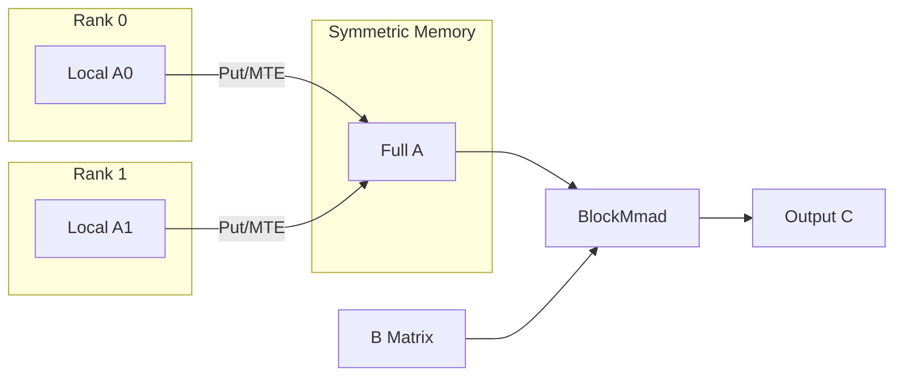
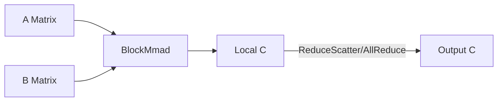
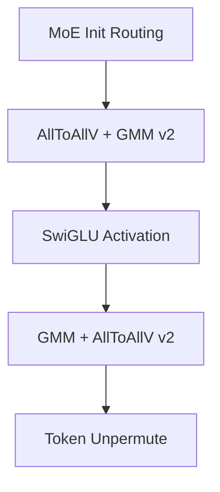

# CATCCOS 算子实现模式

本文档按通信/计算模式说明 CATCCOS 融合算子的**通用实现结构**，不逐算子展开。算子清单见 [operators.md](../operators.md)，API 分层见 [api/api.md](../api/api.md)。

---

## 1. 公共架构

### 1.1 分层模型

CATCCOS 融合算子沿 CATLASS 四层架构组装：

```
Kernel   ← 编排 MMAD 与通信流水线（AIC 计算 + AIV 通信）
Block    ← BlockMmad（计算）+ CommBlock（通信）+ Scheduler
Tile     ← TileRemoteCopy（远端 Put/Get，MTE/RDMA）
Basic    ← AscendC 指令、ACLSHMEM 对称内存
```

跨核同步：`catlass/arch/cross_core_sync.hpp`  
跨卡同步：`catccos/arch/cross_rank_sync.hpp` + ACLSHMEM

### 1.2 示例目录结构

每个可运行算子样例遵循统一布局：

```
examples/<op_name>/
├── <op_name>_host.h      # CatccosOperator 子类 + REGISTER_OPERATOR
├── <op_name>_device.h    # BlockMmad + BlockComm + Kernel 类型组合
├── main.cpp              # 直调入口（ACL/SHMEM 初始化、launch）
├── CMakeLists.txt
├── scripts/
│   ├── build.sh
│   ├── run.sh
│   └── test_shapes.csv   # 测试 shape 配置
└── README.md             # 使用说明（部分算子暂无）
```

### 1.3 Host 模块职责

Host 侧通过 `CatccosOperator` 基类（`utils/catccos_operator.h`）封装 I/O 逻辑：

| 虚函数 | 职责 |
|--------|------|
| `AllocateDeviceSpace` | 申请 Device 内存，精度测试时从文件加载输入 |
| `WriteResultFile` | D2H 拷贝并保存输出，用于精度验证 |
| `GetWorkspaceSize` | 计算 padding / workspace 大小 |
| `GetActualKernelType` | 返回 `CocCommType` 枚举 |
| `CheckCocTilingParams` | 校验 tiling 参数与 SHMEM 限制 |

算子通过 `REGISTER_OPERATOR("OpName", OpClass)` 注册到 `OperatorRegistry`，`main.cpp` 中通过 `OperatorRegistry::Instance().CreateOperator("OpName")` 创建实例。

### 1.4 Device 模块职责

Device 侧在 `*_device.h` 中完成**类型组合**，不包含 Kernel 函数体：

1. 选定 `ArchTag`、tile shape（`L1TileShape` / `L0TileShape`）、dtype/layout
2. 实例化 `BlockMmad`（来自 CATLASS）
3. 实例化 `BlockComm` + `TileRemoteCopy`
4. 选定 compute/comm scheduler（swizzle）
5. 组合为 `DGemm::Kernel::*` 或 `Comm::Kernel::*`
6. 定义 `using Device = Catccos::DGemm::Device::DeviceDGemm<Kernel>`

### 1.5 启动链路

```
main.cpp
  → CatccosOperator::AllocateDeviceSpace
  → DeviceDGemm<Kernel>::Initialize(args)
  → DeviceDGemm<Kernel>::Run(stream, blockDim, fftsAddr)
  → KernelAdapter <<<blockDim, stream>>>(params, fftsAddr)
  → Kernel::operator()(Params)
      → BlockMmad（AIC）与 BlockComm（AIV）流水线并行
```

关键类型：

- `CocTilingParams`（`utils/info.h`）：问题规模与通信 tiling 参数
- `DeviceDGemm<Kernel>`（`include/catccos/dgemm/device/device_dgemm.hpp`）：Host 侧 Kernel 启动器
- `KernelAdapter`（`include/catccos/dgemm/device/kernel_adapter.hpp`）：`<<<>>>` 内核入口

对称内存：`shmem_malloc(SHMEM_BUFF_BYTES)`；FFTS 配置：`shmemx_get_ffts_config()`。

---

## 2. AllGather + MatMul

**适用算子**：`allgather_matmul`、`allgather_matmul_with_gather_result`、`allgather_matmul_remote_read`、`allgather_matmul_rdma` 等，运行于 **Atlas A2/A3** 平台；Atlas 350 变体见第 6、7 节。

**通信语义**：各 rank 持有 A 矩阵的局部行，通过 AllGather 将完整 A 汇聚到对称内存，再执行 `C = A_full × B`。

**数据流**：



**关键组件**：

| 组件 | 典型类型 |
|------|---------|
| Kernel | `DGemm::Kernel::AllGatherMatmul` |
| Compute Scheduler | `GemmBlockSwizzleAllGatherMesh` |
| Comm Scheduler | `BlockCommSwizzle` |
| Tile 搬运 | `CopyDirect::Put` + `CopyTransport::Mte`（RDMA 变体用 `Rdma`） |

**参考示例**：[examples/allgather_matmul/](../../examples/allgather_matmul/)

Remote Read 变体通过 `allgather_matmul_with_remote_read.hpp` 直接从远端 GM 读取 A，减少本地拷贝；RDMA 变体使用 `allgather_matmul_with_rdma_write.hpp` 走 RDMA Write 路径。

---

## 3. MatMul + ReduceScatter / AllReduce

**适用算子**：`matmul_reduce_scatter`、`matmul_allreduce` 等，运行于 **Atlas A2/A3** 平台；Atlas 350 变体（`ascend950_matmul_reduce_scatter`、`ascend950_mxfp8_matmul_reduce_scatter`）见第 6 节。

**通信语义**：各 rank 独立计算局部 C，再通过 ReduceScatter 或 AllReduce 将结果按行/全局规约到目标 rank。

**数据流**：



**关键组件**：

| 组件 | 典型类型 |
|------|---------|
| Kernel | `MatmulReduceScatter`、`MatmulAllReduce` |
| Compute Scheduler | `GemmBlockSwizzleReduceScatterMesh` 等 |
| Comm | 对 C 矩阵分块做远端规约 |

**参考示例**：[examples/matmul_reduce_scatter/](../../examples/matmul_reduce_scatter/)、[examples/matmul_allreduce/](../../examples/matmul_allreduce/)

---

## 4. 量化融合

**适用算子**：`allgather_matmul_dequant*`、`matmul_dequant_reduce_scatter_v2`、`dispatch_gmm_dequant_swiglu` 等，运行于 **Atlas A2/A3** 平台。

**实现要点**：

- 输入为 INT8，通过 `include/catccos/epilogue/block/` 下的 dequant epilogue 在计算路径中反量化
- Kernel 在 AllGather 或 ReduceScatter 模式基础上叠加 epilogue block
- `AllGatherMatmulDequant` 支持 padding 与非 padding 两种 Device 配置（`*_padding_device.h`）

**关键组件**：

| 组件 | 路径 |
|------|------|
| Dequant epilogue | `include/catccos/epilogue/block/` |
| Kernel | `allgather_matmul_dequant.hpp`、`matmul_dequant_reduce_scatter_v2.hpp` |

**参考示例**：[examples/allgather_matmul_dequant_bias/](../../examples/allgather_matmul_dequant_bias/)

---

## 5. MoE / GroupedMatMul + AllToAllV

**适用算子**：`grouped_matmul_alltoallv*`、`alltoallv_*`、`dispatch_*`、`gmm_alltoallv_v2`、`dispatch_ffn_combine` 等，运行于 **Atlas A2/A3** 平台。

**通信语义**：MoE 场景下 token 按 expert 路由，通过 AllToAllV 在各 rank 间交换 token，再执行分组 GEMM（GMM）。

**典型流水线**（以 `dispatch_ffn_combine` 为例）：



**关键组件**：

| 组件 | 典型类型 |
|------|---------|
| Kernel | `GroupedMatmulAllToAllV`、`AllToAllVGMMV2`、`GMMAllToAllVV2` |
| TLA 变体 | `grouped_matmul_alltoallv_tla.hpp` |
| 辅助算子 | `examples/aux_ops/`（routing、unpermute、SwiGLU） |

**参考示例**：[examples/dispatch_ffn_combine/](../../examples/dispatch_ffn_combine/)、[examples/grouped_matmul_alltoallv/](../../examples/grouped_matmul_alltoallv/)

---

## 6. Atlas 350 通用融合

**适用算子**：`ascend950_*` 前缀示例（不含 MX 量化与纯通信类），运行于 **Atlas 350** 平台。

**实现要点**：

- 使用 Atlas 350 架构 tag 与专用 dispatch policy
- 编译需开启 `CATCCOS_ENABLE_A5_BUILD`（Atlas 350 构建）
- AllToAll 类算子（`ascend950_alltoall_matmul`、`ascend950_matmul_alltoall`）通信模式为 AllToAll 而非 AllGather/ReduceScatter
- TLA 路径用于部分 ReduceScatter 与 GroupedMatMul 变体

**关键 Kernel**：

| Kernel | 头文件 |
|--------|--------|
| `Ascend950AllGatherMatmul` | `ascend950_allgather_matmul.hpp` |
| `Ascend950AllToAllMatmul` | `ascend950_alltoall_matmul.hpp` |
| `Ascend950MatmulAllToAll` | `ascend950_matmul_alltoall.hpp` |

**参考示例**：[examples/ascend950_allgather_matmul/](../../examples/ascend950_allgather_matmul/)

---

## 7. Atlas 350 MX 量化

**适用算子**：`ascend950_fp8_mx_*`、`ascend950_fp4_mx_*`，运行于 **Atlas 350** 平台。

**实现要点**：

- 使用 MX 格式（FP8 E4M3 / FP4）作为 A/B 输入，附带 E8M0 scale
- Kernel 基于 `mx_allgather_matmul.hpp` 或 `grouped_matmul_alltoallv_mx.hpp`
- 输出通常为 FP16

**参考示例**：[examples/ascend950_fp8_mx_allgather_matmul/](../../examples/ascend950_fp8_mx_allgather_matmul/)

---

## 8. 纯通信 / 量化通信

**适用算子**：`ascend950_quant_allgather`、`ascend950_quant_alltoall`、`ascend950_mx_quant_allgather`，运行于 **Atlas 350** 平台。

**实现要点**：

- 位于 `Catccos::Comm::Kernel` 命名空间，**不含 BlockMmad**
- 输入 BF16，输出 HiF8 或 MX-FP8/FP4 量化格式
- 仅做通信 + 量化 epilogue，无矩阵乘

**关键 Kernel**：

| Kernel | 头文件 |
|--------|--------|
| `QuantAllGather` | `comm/kernel/quant_allgather.hpp` |
| `QuantAllToAll` | `comm/kernel/quant_alltoall.hpp` |
| `MxQuantAllGather` | `comm/kernel/mx_quant_allgather.hpp` |

**参考示例**：[examples/ascend950_mx_quant_allgather/](../../examples/ascend950_mx_quant_allgather/)

---

## 9. Tiling 参数说明

Host 侧通过 `CocTilingParams`（`utils/info.h`）向 Kernel 传递问题规模与通信 tiling 配置：

| 字段 | 含义 |
|------|------|
| `m`, `k`, `n` | GEMM 问题规模 |
| `m0`, `k0`, `n0` | L1 tile 大小 |
| `commTileM` | 通信 tile 的行粒度 |
| `commInterval` | 计算-通信 overlap 间隔（每完成多少计算 tile 触发一次通信） |
| `commBlockM` | 通信 block 行粒度 |
| `commDataSplit` | 通信数据切分策略 |
| `commNpuSplit` | 多 NPU 间通信切分 |
| `rankSize` | 参与通信的 rank 数 |
| `epSize`, `expertNum`, `topK` | MoE 相关参数 |

`commInterval` 与 CommSwizzle 调度共同决定计算-通信 overlap 程度。算法细节见 [CommSwizzle 算法文档](../comm_swizzle/comm_swizzle_algorithm.md)。

默认 tile 常量（`info.h`）：`M0=128`, `N0=256`, `K0=256`, `WORKSPACE_STAGES=2`, `UB_STAGES=2`。

---

## 10. 开发新算子

1. 在 `include/catccos/dgemm/kernel/` 或 `comm/kernel/` 添加 Kernel 模板
2. 在 `examples/<new_op>/` 创建 host/device/main 文件，参照 [quickstart.md](../quickstart.md)
3. 在 `examples/CMakeLists.txt` 的 `foreach(EXAMPLE ...)` 中注册
4. 在 `*_host.h` 中使用 `REGISTER_OPERATOR` 注册算子名

详细步骤见 [快速上手](../quickstart.md)。
