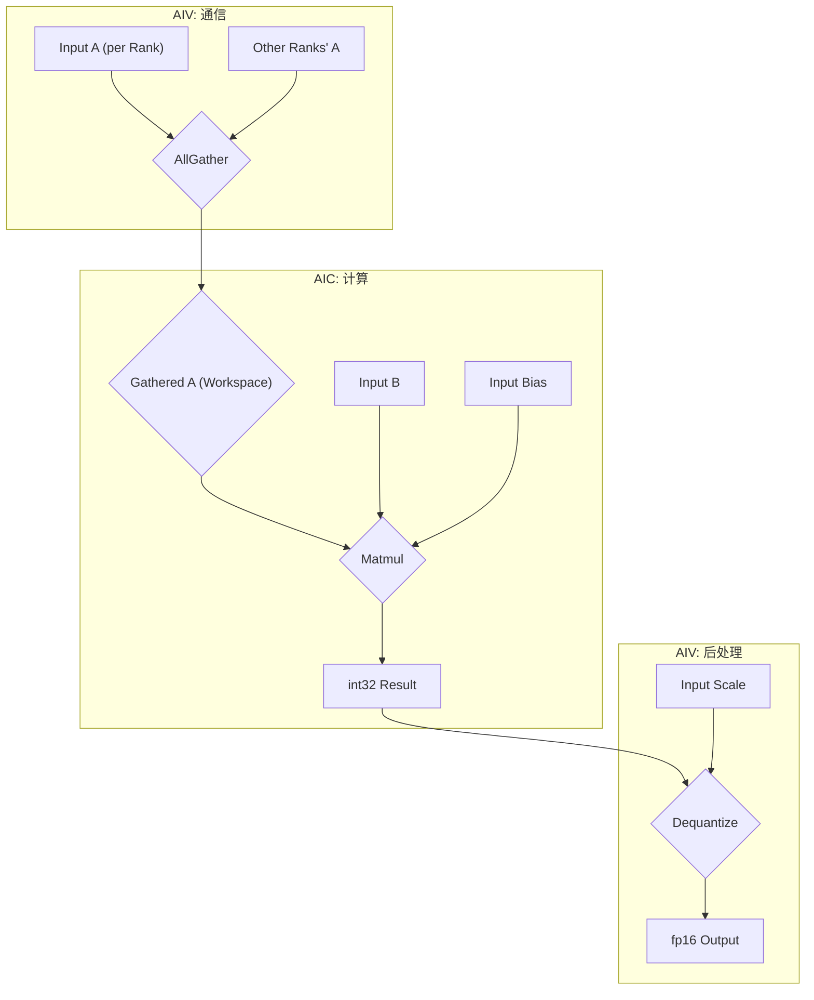
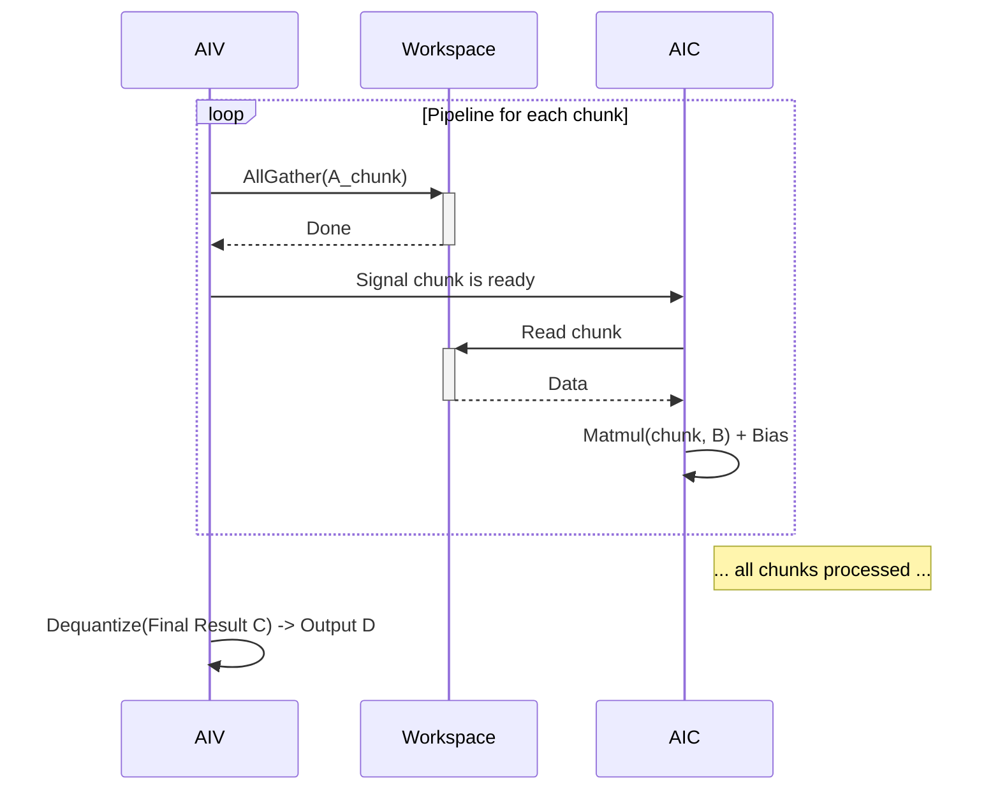

# AllGather矩阵乘法反量化算子设计文档

## 1. 算子概述

### 1.1 功能描述
AllGather矩阵乘法反量化算子（AllGatherMatmulDequant）是一个支持INT8量化和偏置（Bias）的分布式矩阵乘法算子，它结合AllGather通信模式，用于推理场景。

算子的执行是一个流水线过程：首先，AIV核执行`AllGather`操作，将各个Rank的INT8输入矩阵`A`收集到一块共享工作空间中。接着，AIC核基于这块共享空间中的`A`矩阵和本地的`B`矩阵执行`INT8`矩阵乘法，加上偏置，并将`INT32`结果写回。最后，AIV核对`INT32`结果执行反量化，得到最终的`FP16`输出。

### 1.2 算子签名
```cpp
void AllGatherDequantMatmul(
    uint64_t fftsAddr,
    GM_ADDR aDevice,           // 输入矩阵A: [M, K], int8
    GM_ADDR bDevice,           // 输入矩阵B: [K, N], int8
    GM_ADDR cDevice,           // INT32累加结果矩阵: [M*rankSize, N], int32
    GM_ADDR bias,              // 偏置向量: [N], int32
    GM_ADDR symmetricPtr,      // 用于Rank间通信的共享内存工作空间 (workspace)
    GM_ADDR dDevice,           // 输出矩阵: [M*rankSize, N], fp16
    GM_ADDR deviceScale,       // per-channel 量化缩放因子: [N], float32
    uint32_t m,
    uint32_t n,
    uint32_t k
);
```

### 1.3 输入输出规格
| 参数 | 形状 | 数据类型 | 描述 |
|------|------|----------|------|
| aDevice | [M, K] | int8 | 量化后的输入矩阵A |
| bDevice | [K, N] | int8 | 量化后的输入矩阵B |
| cDevice | [M*rankSize, N] | int32 | INT32累加器结果矩阵 |
| bias | [N] | int32 | 加到累加结果上的偏置向量 |
| dDevice | [M*rankSize, N] | fp16 | 输出矩阵 |
| deviceScale | [N] | float32 | B矩阵的per-channel量化缩放因子 |
| symmetricPtr | - | GM_ADDR | 用于AllGather通信的共享内存工作区 |

## 2. 量化算法设计

### 2.1 核心计算流程


### 2.2 量化与反量化公式
```c++
    // 伪代码: AllGather (on AIV)
    // Gathers matrix A from all ranks into a shared workspace
    gathered_a_int8 = allgather(a_int8);

    // 伪代码: Matmul + Bias (on AIC)
    // Uses the gathered A to perform the matmul
    result_int32 = matmul(gathered_a_int8, b_int8) + bias;

    // 伪代码: 反量化 (on AIV)
    // Note: per-token scale is not used
    result_fp32 = result_int32 * scale;
    output_fp16 = cast_to_fp16(result_fp32);
```

## 3. 核心实现架构

### 3.1 计算与通信分离
算子采用计算（AIC）和通信/后处理（AIV）分离的设计。
- **AIC (AI Core)**: 负责执行高密度的 `INT8 × INT8 → INT32` 矩阵乘法计算，并加上偏置。
- **AIV (AI Vector Core)**: 负责执行 `AllGather` 通信，以及后续的 `Dequantize` 反量化处理。

### 3.2 主要模块
- **BlockMmad**: `catlass`库提供的矩阵乘法模块，通过`MmadAtlasA2Pingpong`调度策略，执行分块的INT8矩阵乘法。
- **CommBlockEpilogue**: `catccos`库提供的通信Epilogue，用于执行 `AllGather` 操作。它将所有Rank的INT8矩阵A收集到每个Rank。
- **BlockEpilogueDequant**: `catlass`库提供的后处理Epilogue，用于在 `AllGather` 完成后，对INT32结果进行反量化，并转换为 `FP16`。

## 4. 内存布局设计

### 4.1 全局内存 (Global Memory)
- **输入布局**: `aDevice`, `bDevice`, `bias`, `deviceScale` 均存储在GM中。
- **中间结果布局**: 每个Rank计算出的 `INT32` 累加器结果存储在各自的GM空间中，形状为 `[M*rankSize, N]`。
- **输出布局**: 最终的 `FP16` 输出也存储在GM中，形状为 `[M*rankSize, N]`。

### 4.2 共享内存 (Symmetric Memory)
- **用途**: `symmetricPtr` 指向的共享内存区域被用作 `AllGather` 操作的**临时工作空间（Workspace）**。
- **工作方式**: 在 `AllGather` 过程中，每个Rank需要将自己的INT8矩阵A写入到共享内存区域，然后所有Rank从这个区域读取完整的矩阵A。
- **布局**:
  ```cpp
  Catlass::layout::RowMajor layoutSymmetric{
      WORKSPACE_STAGES * rankSize * commSizeM,
      K,
      K
  };
  ```

## 5. 通信模式适配

### 5.1 流水线计算与通信
算子的核心是一个计算与通信流水线，而不是分立的阶段。
1.  **通信 (AIV)**: AIV核启动 `AllGather` 操作，将一个分片(chunk)的 `A` 矩阵从所有Rank收集到共享内存工作区。
2.  **计算 (AIC)**: 一旦某个分片的 `A` 矩阵数据准备就绪，AIC核立即对该分片执行 `Matmul(A_chunk, B) + Bias` 计算，并将结果累加到 `C` 矩阵。
3.  **后处理 (AIV)**: 在所有计算完成后，AIV核对最终的 `C` 矩阵（INT32）执行反量化，生成最终的 `FP16` 输出。

这个过程通过多级缓冲（`WORKSPACE_STAGES`）进行流水线处理，以重叠通信和计算，隐藏延迟。

### 5.2 流程图


## 6. 工作空间管理

### 6.1 多阶段流水线
算子使用 `WORKSPACE_STAGES = 2` 的多阶段流水线设计，通过 `commInterval = 3` 控制通信间隔，实现计算与通信的重叠。

### 6.2 内存复用策略
- **共享内存复用**: 使用共享内存作为AllGather操作的临时缓冲区，避免重复分配。
- **流水线缓冲**: 通过多阶段设计，实现计算与通信的并行执行。

## 7. 总结

该量化算子通过将高成本的通信操作（AllGather）在 `INT8` 数据上完成，避免了在 `FP16` 或 `FP32` 上进行通信，从而优化了性能。同时，通过精确的量化参数处理，确保了在多Rank环境下的计算精度。共享内存（Symmetric Memory）在此过程中扮演了关键的临时数据交换区的角色。

## 8. 使用指南

### 8.1 编译

```bash
cd examples/allgather_matmul_dequant/
bash scripts/build.sh
```

### 8.2 运行

```bash
# 在2个设备上运行（设备0和1）
bash scripts/run.sh 0,1

# 在4个设备上运行（设备1, 3, 5, 7）
bash scripts/run.sh 1,3,5,7
```

### 8.3 测试形状

测试形状定义在 `scripts/test_shapes.csv` 中：
```
M,K,N
16384,27392,4096
131072,8192,3072
64,16384,7168
```

### 8.4 数据文件

在 `output/` 目录中生成以下数据文件：
- `x1_gm.bin`: 量化输入矩阵A (int8)
- `x2_gm.bin`: 量化输入矩阵B (int8)
- `bias_gm.bin`: 偏置向量 (int32)
- `c_gm.bin`: 中间累加结果矩阵 (int32)
- `d_gm.bin`: 输出矩阵 (fp16)
- `scale_x2_gm.bin`: 矩阵B的per-channel量化缩放因子 (float32)
- `golden.bin`: 验证用的期望输出 (fp16)
- `output.bin`: 算子的实际输出 (fp16)

### 8.5 验证

脚本会自动验证输出结果与黄金参考的差异，使用现有的 `verify_result.py` 进行精度验证。该验证脚本支持 fp16 数据类型的精度检查。

### 8.6 调试模式

设置环境变量启用调试模式：
```bash
export debug=1
bash scripts/run.sh 0,1
```

调试模式下会使用全1矩阵和固定缩放因子，便于问题排查。

### 8.7 环境要求

- Ascend Toolkit 已正确安装
- SHMEM 环境已配置
- PyTorch 支持（用于数据生成和验证）
- 支持 fp16 数据类型的硬件环境
