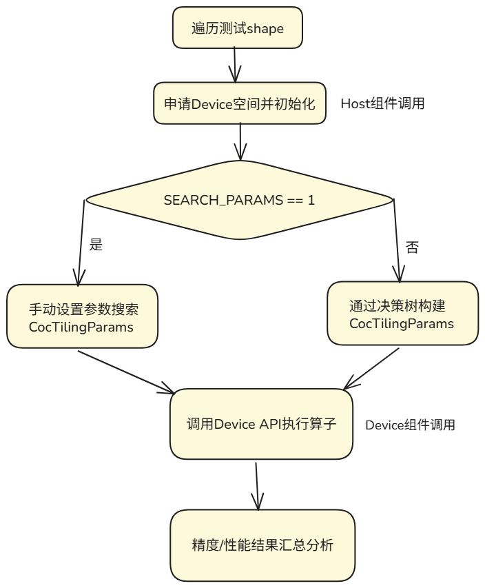

# 动态Tiling测试介绍

## 1. 功能说明
支持多卡场景下的精度测试和批量性能测试，批量测试所需的tiling参数构造接口在include文件夹下实现，examples内的算子在impl文件夹下添加对应DeviceDGemm调用函数后即可支持。

## 2. 流程简介



# 使用方式

## 1. 编译项目

进入测试目录并执行编译脚本。默认编译 A2（dav-c220）算子；通过 `-soc_type Ascend950` 可**额外**编译 Ascend950（a5agmm / a5mmrs）算子。

> 说明：`tests/dynamic_tiling` 与 `examples/` 算子独立配置。编译 example 时不会加载本测试目录；仅运行本目录下 `scripts/build.sh` 时才会出现 `tests/dynamic_tiling:` 相关日志。

```bash
cd tests/dynamic_tiling

# 默认仅 A2（agmm / mmrs / mmar 等）
bash scripts/build.sh

# A2 + Ascend950（在 A2 基础上额外编译 a5agmm / a5mmrs）
bash scripts/build.sh -soc_type Ascend950
```

## 2. 运行 Dynamic-Tiling 示例程序

在测试目录下执行运行脚本：

```bash
bash scripts/run.sh <kernel_name> <data_type> [test_start_line] [test_collect_rows] <device_list>
```

### 参数说明

| 参数 | 说明 | 取值示例 |
|------|------|---------| 
| `kernel_name` | 通信-计算融合算子缩写, 在tests/dynamic_tiling/include/launch_map.h内设定 | `mmar`: MATMUL_ALLREDUCE<br>`agmm`: ALLGATHER_MATMUL<br>`mmrs`: MATMUL_REDUCE_SCATTER |
| `data_type` | 数据类型 | `1`: FP16<br>`27`: BF16 |
| `test_start_line`（可选） | 测试起始行索引（对应`test_shapes.csv`中的行号，从0开始）<br>需与 `test_collect_rows` 一同指定，用于性能测试 | `0`, `10`, `...` |
| `test_collect_rows`（可选） | 每次采集性能数据的测试用例数量 | `5`, `10`, `...` |
| `device_list` | 指定运行的设备（NPU）编号列表，以逗号分隔 | `0,1`, `4,5,6,7` |

> **注意**：  
> - `rankSize`由`device_list`中设备数量自动确定
> - 精度测试默认按顺序执行test_shapes.csv中定义的所有shape
> - 性能测试需指定test_start_line和test_collect_rows参数：从第test_start_line个shape开始，每次采集test_collect_rows个测试用例，持续执行直至文件末尾

### 示例

- **精度测试示例**：  
  使用 NPU 0 和 1，运行 **MatMul-AllReduce** 精度测试，数据类型为FP16，`rankSize = 2`：
  ```bash
  bash scripts/run.sh "mmar" 1 0,1
  ```

- **性能测试示例**：  
  使用 NPU 4、5、6、7，运行 **AllGather-MatMul** 性能测试，数据类型为 BF16，从 `test_shapes.csv` 第0行开始，每 10 个 shape 采集一次 `msprof` 性能数据，`rankSize = 4`：
  ```bash
  bash scripts/run.sh "agmm" 27 0 10 4,5,6,7
  ```

- **Ascend950 算子示例**（FP16，`libkernel_fp16_ascend950.so`）：
  ```bash
  bash scripts/run.sh "a5agmm" 1 0,1          # AllGather-MatMul 精度
  bash scripts/run.sh "a5mmrs" 1 0,1         # MatMul-ReduceScatter 精度
  bash scripts/run.sh "a5mmrs" 1 0 10 0,1   # MatMul-ReduceScatter 性能（LUT）
  ```

## 3. 配置计算规模

矩阵计算参数（包括 `M`, `K`, `N`, `Transpose A`, `Transpose B`）在配置文件中定义：

```
scripts/test_shapes.csv
```

请根据测试需求修改该文件，添加或调整测试用例的输入维度和属性。

---

**提示**：  
- 确保设备编号正确且可用。  
- 建议在性能测试前清理无关进程，以保证数据准确性。  
- 性能数据默认输出至 `output/` 目录。

---

# 新增算子指导

本节以 `MatmulAllReduce` 为例，详细说明如何新增一个通算融合算子并接入批量测试框架。

## 1. 算子缩写与算子enum对照表

| 算子缩写 | 算子类型 |
|--------|------|
| mmar | MATMUL_ALLREDUCE |
| agmm | ALLGATHER_MATMUL |
| mmrs | MATMUL_REDUCE_SCATTER |
| agmmwg | ALLGATHER_MATMUL_WITH_GATHER_RESULT |
| gmmata | GROUPED_MATMUL_ALLTOALLV |
| atavgmm | ALLTOALLV_GROUPED_MATMUL |
| agmmrdma | ALLGATHER_MATMUL_RDMA |
| agmmrr | ALLGATHER_MATMUL_REMOTE_READ |
| a5agmm | ASCEND950_ALLGATHER_MATMUL |
| a5mmrs | ASCEND950_MATMUL_REDUCE_SCATTER |
| atavgmmv2 | ALLTOALLV_GMM_V2 |
| agmmdq | ALLGATHER_MATMUL_DEQUANT |
| agmmdqbs | ALLGATHER_MATMUL_DEQUANT_BIAS |

## 2. 相关目录结构说明

```plaintext
catccos/
├── include/catccos/
│   ├── comm/                   # 通信组件
│   │   ├── block/              # block层数据搬运策略
│   │   ├── tile/               # tile层数据搬运模式
│   │   └── comm_dispatch_policy.hpp
│   ├── detail/                 # 数据搬运模式枚举
│   └── dgemm/
│       ├── block/              # block层矩阵乘swizzle
│       ├── device/             # DeviceDGemm设备层封装
│       │   └── device_dgemm.hpp  # 提供Initialize(args)+Run(stream)接口
│       └── kernel/             # 算子kernel文件 ★新增算子在此添加★
│           ├── matmul_allreduce.hpp
│           ├── allgather_matmul.hpp
│           └── ...
├── examples/
│   └── matmul_allreduce/       # 每个算子一个目录
│       ├── matmul_allreduce_device.h   # Config模板+DeviceDGemm类型定义
│       ├── matmul_allreduce_host.h     # host侧接口(内存申请/结果写入/算子注册)
│       └── main.cpp                    # 单算子执行用例
└── tests/dynamic_tiling/      # 批量性能测试框架
    ├── impl/                   # 各算子Launch函数 ★新增算子在此添加★
    │   ├── kernel_fp16.cpp
    │   └── kernel_bf16.cpp
    ├── include/
    │   ├── launch_map.h        # REGISTER_KERNEL_FUNC注册宏
    │   └── operator_host.h     # 汇总所有算子host头文件
    ├── scripts/
    ├── tiling/
    └── main.cpp
```

## 3. 新增算子流程（以matmul_allreduce为例）

### Step 1: 添加算子Kernel层实现

在 `include/catccos/dgemm/kernel/` 下新建 `matmul_allreduce.hpp`。

**关键要求**：

- **Params结构体** — 存储kernel执行所需的全部参数（含layouts、通信参数等嵌套结构体）。构造函数必须标记为 `CATLASS_HOST_DEVICE`，使其可在Host侧构造。

- **Arguments结构体** — 用户侧扁平参数接口，仅包含裸指针、shape、通信参数等基本类型，不含layout或嵌套BlockCommParams：

```cpp
struct Arguments {
    GemmCoord problemShape;
    uint32_t rankIdx;
    uint32_t rankSize;
    uint32_t commInterval;
    GM_ADDR ptrA;
    GM_ADDR ptrB;
    GM_ADDR ptrD;
    GM_ADDR ptrSymmetric;
    MatrixCoord commCoreSplit;
    MatrixCoord commBlockShape;
    MatrixCoord commTileShape;
};
```

- **ToUnderlyingArguments静态方法** — 将Arguments转换为Params，在此处根据shape构造Layout、从commTileShape构造BlockCommParams等嵌套结构：

```cpp
static Params ToUnderlyingArguments(Arguments const &args)
{
    // 根据problemShape构造layout
    LayoutA layoutA{args.problemShape.m(), args.problemShape.k()};
    LayoutB layoutB{args.problemShape.k(), args.problemShape.n()};
    LayoutD layoutD{args.problemShape.m(), args.problemShape.n()};

    // 从扁平的MatrixCoord构造嵌套通信参数
    typename BlockReduceScatter::TileRemoteCopy::Params tileParams{args.commTileShape};
    ReduceScatterParams reduceScatterParams{args.commBlockShape, tileParams};
    AllGatherParams allGatherParams{args.commBlockShape, tileParams};
    CommSchedulerParams commSchedulerParams{args.commCoreSplit};

    return Params(
        args.problemShape,
        args.rankIdx, args.rankSize,
        args.commInterval,
        args.ptrA, layoutA,
        args.ptrB, layoutB,
        args.ptrD, layoutD,
        args.ptrSymmetric,
        reduceScatterParams,
        allGatherParams,
        commSchedulerParams
    );
}
```

### Step 2: 新增examples样例

1. 在 `examples/` 下新建 `matmul_allreduce/` 文件夹。
2. 在 `examples/CMakeLists.txt` 里添加 matmul_allreduce 的 EXAMPLES 条目。

### Step 3: 添加算子Host组件

在 `matmul_allreduce/` 下新建 `matmul_allreduce_host.h`：
- 实现 `OperatorBase` 的子类，通过 `REGISTER_OPERATOR("MatmulAllReduce", MatmulAllReduceOperator)` 宏注册。
- 实现 `AllocateDeviceSpace`（分配A/B/C设备内存并读入golden数据）、`WriteResultFile`（写出结果）、`GetWorkspaceSize` 等虚函数。

在 `tests/dynamic_tiling/include/operator_host.h` 中添加：
```cpp
#include "matmul_allreduce/matmul_allreduce_host.h"
```

### Step 4: 添加算子Device组件（Config模板 + DeviceDGemm）

在 `matmul_allreduce/` 下新建 `matmul_allreduce_device.h`，定义Config模板结构体。

**Config模板结构**：将BlockMmad、BlockComm等组件类型封装为类型别名，最终导出 `Kernel` 和 `Device` 类型：

```cpp
template <
    class ElementA, class LayoutA,
    class ElementB, class LayoutB,
    class ElementD, class LayoutD,
    uint32_t M0_, uint32_t N0_, uint32_t K0_
>
struct MatmulAllReduceConfig {
    using ArchTag = Catlass::Arch::AtlasA2;

    // 1. 定义计算策略
    using MmadDispatchPolicy = Catlass::Gemm::MmadAtlasA2Pingpong<true>;
    using L1TileShape = Catlass::GemmShape<M0_, N0_, K0_>;
    using L0TileShape = Catlass::GemmShape<M0_, N0_, 64>;

    // 2. 定义数据类型
    using AType = Catlass::Gemm::GemmType<ElementA, LayoutA>;
    using BType = Catlass::Gemm::GemmType<ElementB, LayoutB>;
    using DType = Catlass::Gemm::GemmType<ElementD, LayoutD>;

    // 3. 定义计算Block
    using BlockMmad = Catlass::Gemm::Block::BlockMmad<
        MmadDispatchPolicy, L1TileShape, L0TileShape, AType, BType, DType>;

    // 4. 定义通信Block
    using TileRemoteCopy = Comm::Tile::TileRemoteCopy<...>;
    using BlockReduceScatter = Comm::Block::CommBlock<...>;
    using BlockAllGather = Comm::Block::CommBlock<...>;

    // 5. 组装Kernel
    using Kernel = DGemm::Kernel::MatmulAllReduce<
        BlockMmad, BlockReduceScatter, BlockAllGather,
        BlockMmadScheduler, BlockScheduler, WORKSPACE_STAGES>;

    // 6. 导出DeviceDGemm
    using Device = Catccos::DGemm::Device::DeviceDGemm<Kernel>;
};
```

**定义M0别名**，供host侧按tiling参数选择不同实例化：

```cpp
template <class EA, class LA, class EB, class LB, class ED, class LD>
using MatmulAllReduceConfig_M0_128 = MatmulAllReduceConfig<EA, LA, EB, LB, ED, LD, 128, 256, 256>;

template <class EA, class LA, class EB, class LB, class ED, class LD>
using MatmulAllReduceConfig_M0_256 = MatmulAllReduceConfig<EA, LA, EB, LB, ED, LD, 256, 128, 256>;
```

### Step 5: 更新example的main.cpp

使用 DeviceDGemm 的 `Initialize` + `Run` API 调用算子：

```cpp
#include "matmul_allreduce_device.h"

using Config = MatmulAllReduceConfig_M0_128<ElementA, LayoutA, ElementB, LayoutB, ElementD, LayoutD>;
using DeviceOp = Config::Device;

// ... 初始化 ACL、shmem、KernelParams ...

DeviceOp::Arguments args{
    problemShape,
    static_cast<uint32_t>(rankId), static_cast<uint32_t>(rankSize),
    cocTiling.commInterval,
    kernelParams.ptrA, kernelParams.ptrB, kernelParams.ptrC, gmSymmetric,
    commCoreSplit, commBlockShape, commTileShape
};

DeviceOp deviceOp;
deviceOp.Initialize(args);        // Host侧构造Params
deviceOp.Run(stream, BLOCK_NUM, fftsAddr);  // 启动kernel
```

### Step 6: 添加dynamic_tiling测试支持

在 `tests/dynamic_tiling/impl/kernel_fp16.cpp`（和 `kernel_bf16.cpp`）中：

**6.1** 添加头文件引用：
```cpp
#include "matmul_allreduce/matmul_allreduce_device.h"
```

**6.2** 实现模板launch函数。通过模板参数 `ConfigAlias` 接收不同M0的Config，内部构造 `DeviceOp::Arguments` 并调用 Initialize + Run：

```cpp
template <template <class, class, class, class, class, class> class ConfigAlias>
static void LaunchMatmulAllReduceWithConfig(
    void *stream, uint64_t fftsAddr,
    KernelParams& kernelParams,
    uint8_t *symmetricPtr, CocTilingParams& cocTiling,
    uint32_t transA, uint32_t transB)
{
    auto launch = [&](auto &&deviceOp) {
        using DeviceOp = std::decay_t<decltype(deviceOp)>;
        Catlass::GemmCoord problemShape{cocTiling.m, cocTiling.n, cocTiling.k};
        Catlass::MatrixCoord commCoreSplit{cocTiling.commDataSplit, cocTiling.commNpuSplit};
        Catlass::MatrixCoord commBlockShape{cocTiling.commBlockM, cocTiling.n0};
        Catlass::MatrixCoord commTileShape{cocTiling.commTileM / 2, cocTiling.n0};
        typename DeviceOp::Arguments args{
            problemShape,
            static_cast<uint32_t>(shmem_my_pe()), static_cast<uint32_t>(shmem_n_pes()),
            cocTiling.commInterval,
            kernelParams.ptrA, kernelParams.ptrB, kernelParams.ptrC, symmetricPtr,
            commCoreSplit, commBlockShape, commTileShape
        };
        DeviceOp op;
        op.Initialize(args);
        op.Run((aclrtStream)stream, BLOCK_NUM, fftsAddr);
    };
    // 根据transA/transB选择不同Layout组合
    if (!transA && !transB) {
        launch(typename ConfigAlias<ElementA, LayoutA0, ElementB, LayoutB0, ElementC, LayoutC>::Device{});
    } else if (!transA && transB) {
        launch(typename ConfigAlias<ElementA, LayoutA0, ElementB, LayoutB1, ElementC, LayoutC>::Device{});
    } else if (transA && !transB) {
        launch(typename ConfigAlias<ElementA, LayoutA1, ElementB, LayoutB0, ElementC, LayoutC>::Device{});
    } else {
        launch(typename ConfigAlias<ElementA, LayoutA1, ElementB, LayoutB1, ElementC, LayoutC>::Device{});
    }
}
```

**6.3** 实现公开dispatch函数。按 `cocTiling.m0` 值选择 M0_128 或 M0_256 的Config：

```cpp
void LaunchMatmulAllReduceFP16(
    void *stream, uint64_t fftsAddr,
    KernelParams& kernelParams,
    uint8_t *workSpace,
    uint8_t *symmetricPtr, CocTilingParams& cocTiling,
    uint32_t transA, uint32_t transB)
{
    (void)workSpace;
    if (cocTiling.m0 == 128) {
        LaunchMatmulAllReduceWithConfig<MatmulAllReduceConfig_M0_128>(
            stream, fftsAddr, kernelParams, symmetricPtr, cocTiling, transA, transB);
    } else {
        LaunchMatmulAllReduceWithConfig<MatmulAllReduceConfig_M0_256>(
            stream, fftsAddr, kernelParams, symmetricPtr, cocTiling, transA, transB);
    }
}
```

> 注意：BF16版本在 `kernel_bf16.cpp` 中实现，将 `ElementA/B/C` 替换为 `bfloat16_t`，函数名后缀改为 `BF16`。

**6.4** 在 `tests/dynamic_tiling/include/launch_map.h` 中注册算子：

```cpp
// FP16
REGISTER_KERNEL_FUNC(MatmulAllReduce, MATMUL_ALLREDUCE, FP16);
// BF16
REGISTER_KERNEL_FUNC(MatmulAllReduce, MATMUL_ALLREDUCE, BF16);
```

`REGISTER_KERNEL_FUNC` 宏展开后会声明函数 `LaunchMatmulAllReduceFP16` 并自动注册到 `KernelDispatcher`，运行时通过 `(CocCommType, CocDataType)` 二元组查询到对应的launch函数。

### Step 7: 在info.h补充算子类型信息

在 `examples/utils/info.h` 中完成以下三处修改：

**7.1** 在 `CocCommType` 枚举中新增算子类型：
```cpp
enum CocCommType {
    MATMUL_ALLREDUCE = 0,
    ALLGATHER_MATMUL,
    // ... 已有类型 ...
    MY_NEW_OPERATOR,    // <-- 新增
    TYPE_NUM,
    UNKNOWN
};
```

**7.2** 在 `CommTypeMap` 中补充算子缩写映射（用于命令行参数解析）：
```cpp
const std::map<std::string, CocCommType> CommTypeMap = {
    {"mmar", CocCommType::MATMUL_ALLREDUCE},
    // ... 已有映射 ...
    {"myop", CocCommType::MY_NEW_OPERATOR},    // <-- 新增
};
```

**7.3** 在 `CommTypeOpNameMap` 中添加算子名称映射（用于查询host组件注册接口）：
```cpp
const std::map<CocCommType, std::string> CommTypeOpNameMap = {
    { MATMUL_ALLREDUCE, "MatmulAllReduce" },
    // ... 已有映射 ...
    { MY_NEW_OPERATOR, "MyNewOperator" },    // <-- 新增，需与host.h中REGISTER_OPERATOR的名称一致
};
```

---

## 4. 核心架构说明

**DeviceDGemm** 是设备层的统一封装，位于 `include/catccos/dgemm/device/device_dgemm.hpp`，提供两个核心接口：
- `Initialize(Arguments)` — 在Host侧调用 `Kernel::ToUnderlyingArguments(args)` 将用户参数转换为Kernel::Params
- `Run(stream, blockNum, fftsAddr)` — 启动kernel执行
